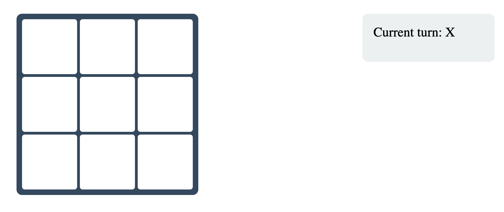

# Advanced Tic Tac Toe Game

A modern web-based implementation of the classic Tic Tac Toe game with additional strategic elements and time constraints.

## Features

### Basic Game Rules
- Two players take turns placing X's and O's on a 3x3 grid
- First player to align three of their marks horizontally, vertically, or diagonally wins
- Players can see whose turn it is on the right side of the board

### Advanced Mechanics
- **Limited Moves**: Each player can have a maximum of 3 moves on the board at any time
- **Move Replacement**: When attempting a 4th move, the player's oldest move is automatically removed
- **Time Constraint**: When a player has 2 moves on the board, they have 10 seconds to make their third move
- **Time Penalty**: If a player exceeds the 10-second limit, their oldest move is removed

### User Interface
- Clean and modern design
- Responsive grid layout
- Hover effects on cells
- Visual timer countdown
- Current player indicator

### Game States
- **In Progress**: Active gameplay with alternating turns
- **Winner**: Displays congratulation message when a player wins
- **Time's Up**: Shows alert when time limit is exceeded

### End Game Options
- **Restart Game**: Clears the board and resets all game states
- **Exit Game**: Closes the game with a farewell message

## Technical Features
- Built with pure HTML, CSS, and JavaScript
- No external dependencies
- Responsive design that works on all devices
- Modular code structure using ES6 classes
- Real-time timer implementation
- State management for game progression
- Event handling for user interactions

## Game Flow
1. Game starts with player X
2. Players alternate placing their marks
3. After placing 2 marks, 10-second timer starts for next move
4. If timer expires, oldest mark is removed
5. Game continues until:
   - A player wins by aligning 3 marks
   - Players choose to restart or exit

## Modal System
- Displays game status messages
- Shows win/loss notifications
- Provides restart and exit options
- Animated transitions for better user experience

## Time Management
- Visual countdown timer
- Automatic move removal on timeout
- Timer resets between turns
- Only activates when a player has 2 moves

## Move Management
- Tracks moves for each player
- Maintains move history
- Handles automatic removal of oldest moves
- Enforces 3-move maximum limit

## Styling
- Modern color scheme
- Responsive grid layout
- Interactive hover effects
- Clear visual feedback
- Smooth animations
